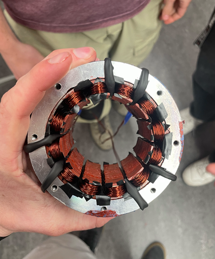

# BLDC Motor Boat System

Custom-designed brushless DC motor boat integrating motor design, mechanical housing, and embedded user control.

This project focused on end-to-end system integration from motor construction to real-world operation.

---

## System Demonstration

Boat operating in drag race.

[Watch Demonstration Video](VIDEO_LINK_HERE)

---

## Custom BLDC Motor Design

### 12-Pole / 10-Slot Configuration
- Custom stator configuration
- Hand-wound copper windings
- Integrated into sealed housing

---

## Mechanical View

---

## Control & User Interface

- Arduino Uno-based joystick control
- Throttle and direction control logic
- Real-time user feedback interface for motor RPM, motor temp, and run time

