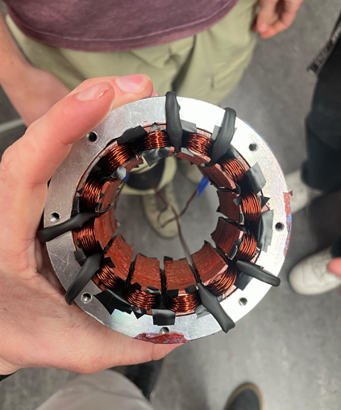

# BLDC Motor Boat System

End-to-end electromechanical system integrating custom motor design, mechanical housing, embedded control, and real-world testing.

This project includes motor construction, mechanical integration, control logic, and user interface development, validated through live operation.

---

## System Demonstration

Real-world performance validation through competitive drag racing.

[Watch Demonstration Video](https://youtu.be/qGRBWFyrM-k)

---

## Custom BLDC Motor Design

Designed and built custom brushless DC motors with integrated mechanical housing.

### Key Features
- 12-pole / 10-slot stator configuration
- Hand-wound copper windings
- Sealed motor housing for water operation

### Design Views

  
  

---

## Mechanical Integration

Full housing and assembly designed to support motor operation in a water-based environment.

  

---

## Control & User Interface

Embedded control system enabling real-time user input and system feedback.

### Key Features
- Arduino Uno-based joystick control
- Throttle and directional control logic
- Real-time monitoring of motor RPM, motor temperature, and runtime

  

