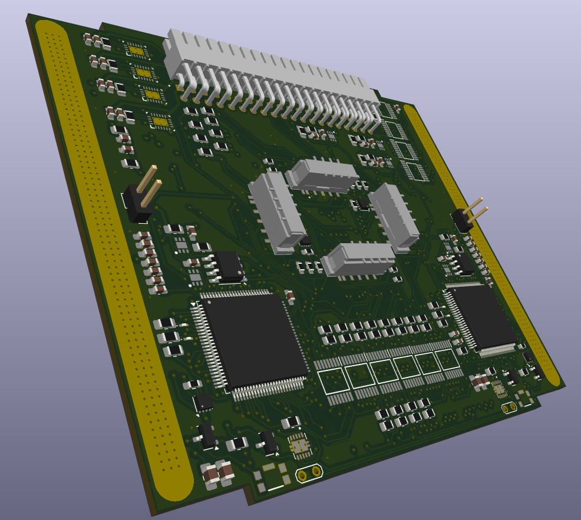
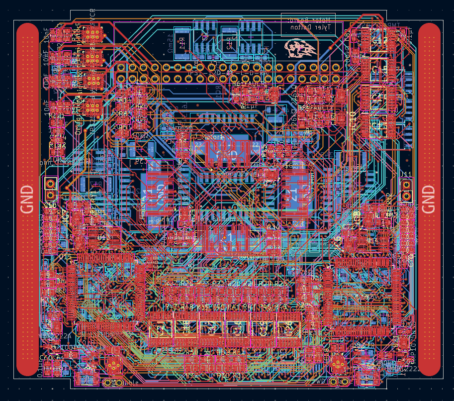
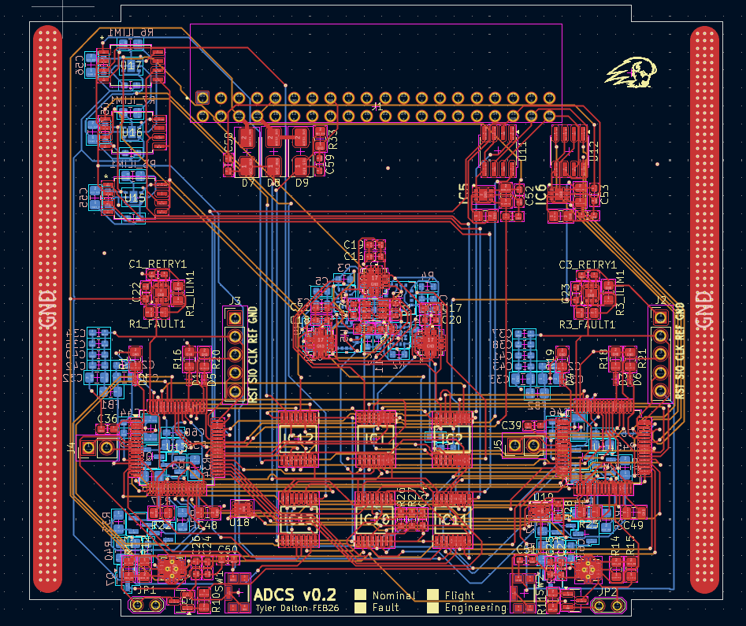

# CubeSat System

Grant-funded university capstone project involving the design and integration of multi-layer PCBs for satellite subsystems.

Public repository contains visuals only. Full design files are restricted.

---

# Motor Driver Board

### Key Highlights
- 6-layer PCB stackup
- High-current BLDC phase routing
- Integrated current sensing and hall sensors for FOC control
- Dual STM32 microcontroller integration

---

### 3D View (Top)

---

### 3D View (Bottom)

---

### Routing Overview

---

# Control Board

### Key Highlights
- Multi-sensor integration (IMU, gyro, magnetometer)
- I2C and SPI bus routing
- Compact layout within CubeSat volume constraints
- Integrated power regulation and filtering

---

### 3D View (Top)

---

### 3D View (Bottom)

---

### Routing Overview

