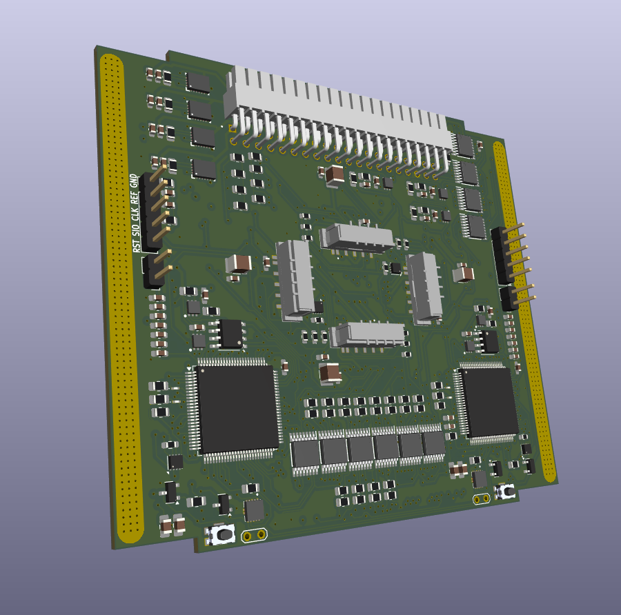
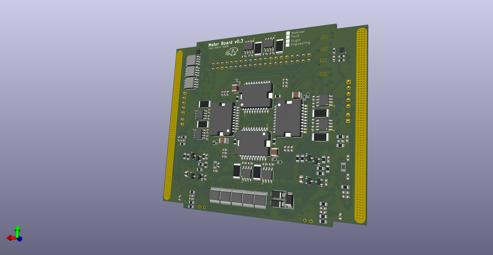
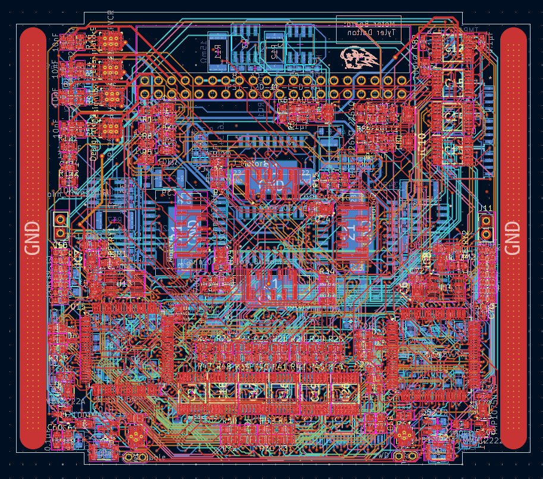
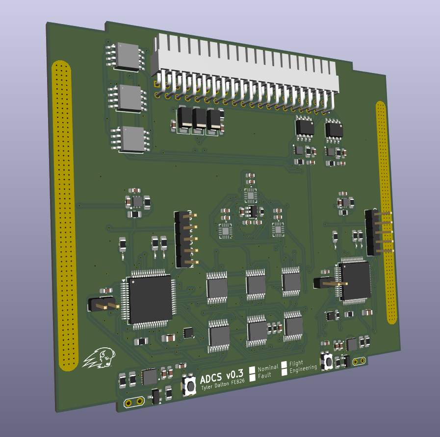
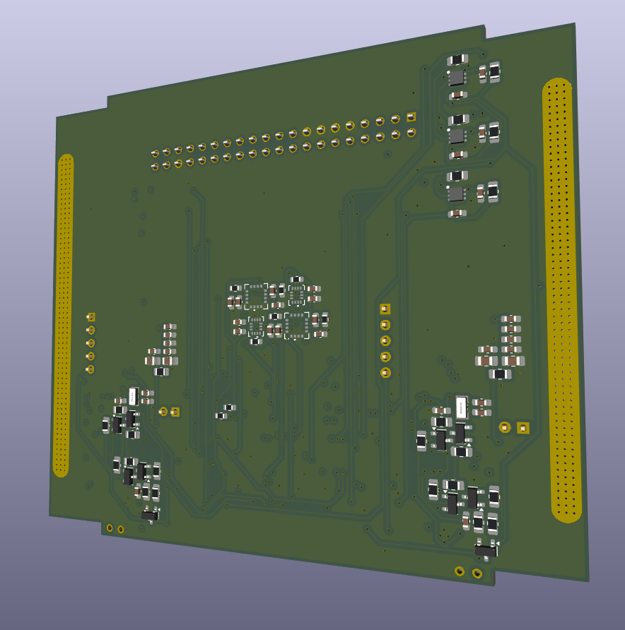
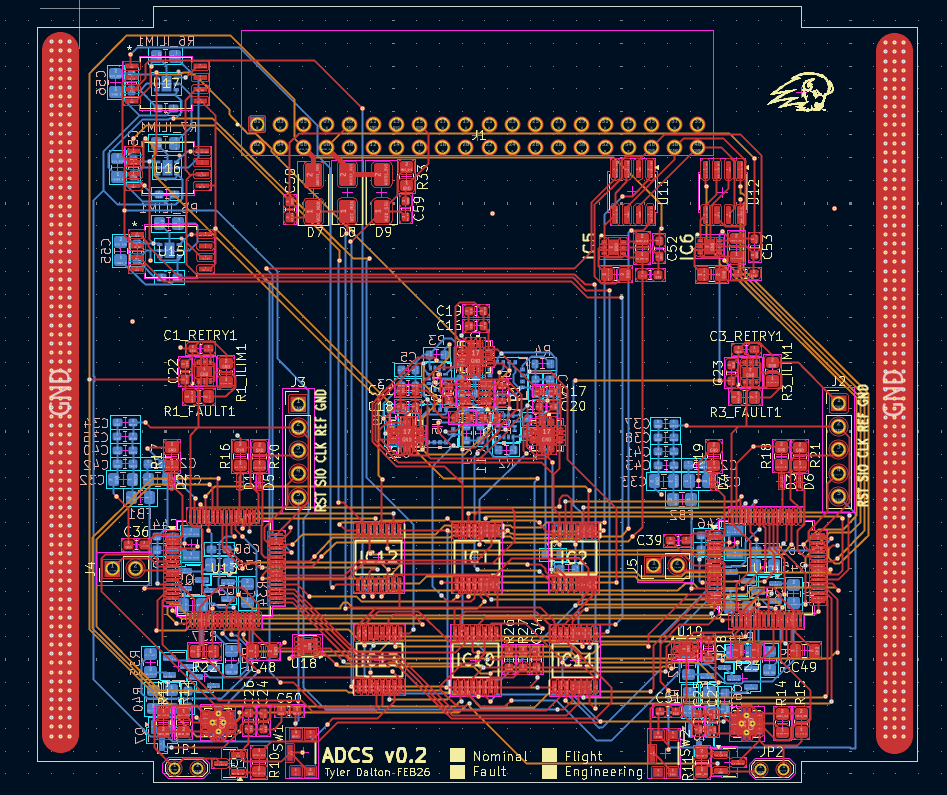

# CubeSat System

Grant-funded capstone project focused on the design and integration of multi-layer PCBs for satellite subsystems.

This repository contains visual documentation only. Full design files are restricted.

---

## System Overview
Complete CubeSat assembly showing integrated avionics, control, and payload subsystems.

  

---

## Motor Driver Board

High-power motor control board designed for satellite actuation, supporting BLDC operation and closed-loop control.

### Key Features
- 6-layer PCB stackup for power integrity and routing density  
- High-current BLDC phase routing  
- Integrated current sensing and hall sensors for FOC control  
- Dual STM32 microcontroller architecture  

### 3D Views

  
  

### Physical Board

  

### Routing Overview

  

---

## Control Board (ADCS)

Attitude Determination and Control System (ADCS) board integrating multiple sensors and communication buses for spacecraft orientation and control.

### Key Features
- Multi-sensor integration (IMU, gyro, magnetometer)  
- I2C and SPI communication architecture  
- Compact layout within CubeSat volume constraints  
- Integrated power regulation and filtering  

### 3D Views

  
  

### Physical Board

  

### Routing Overview

  

